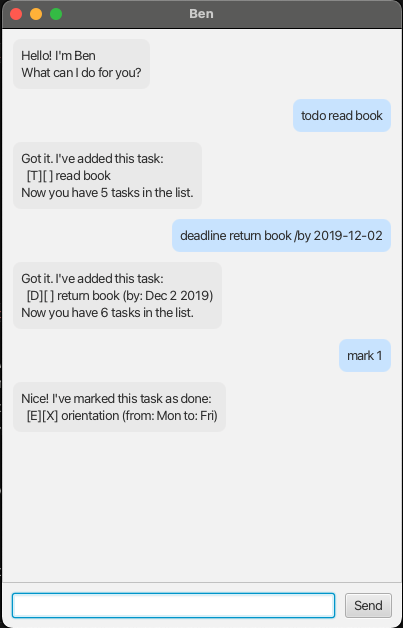

# Ben User Guide



Ben is a desktop chatbot for tracking your tasks — todos, deadlines, and events — via a simple line of text per command. If you can type fast, Ben can manage your tasks faster than a traditional GUI app.

* [Quick start](#quick-start)
* [Adding a todo: `todo`](#adding-a-todo-todo)
* [Adding a deadline: `deadline`](#adding-a-deadline-deadline)
* [Adding an event: `event`](#adding-an-event-event)
* [Listing all tasks: `list`](#listing-all-tasks-list)
* [Marking a task as done: `mark`](#marking-a-task-as-done-mark)
* [Unmarking a task: `unmark`](#unmarking-a-task-unmark)
* [Deleting a task: `delete`](#deleting-a-task-delete)
* [Finding tasks: `find`](#finding-tasks-find)
* [Tagging a task: `tag`](#tagging-a-task-tag)
* [Exiting: `bye`](#exiting-bye)
* [Saving the data](#saving-the-data)
* [FAQ](#faq)
* [Command summary](#command-summary)

## Quick start

1. Ensure you have Java 25 installed.
2. Download the latest `ben.jar` from the [releases page](https://github.com/bentengly/ip/releases).
3. Copy the file to the folder you want to use as the home folder for Ben.
4. Open a terminal, `cd` into that folder, and run:

   ```
   java -jar ben.jar
   ```

5. A window like the one above should appear. Type a command in the text box at the bottom and press Enter (or click **Send**) to try it out.

   Some example commands you can try:
   * `list` — shows your task list (empty at first)
   * `todo read book` — adds a todo
   * `delete 1` — deletes the 1st task in the list

6. Refer to the [Features](#adding-a-todo-todo) sections below for details of each command.

## Adding a todo: `todo`

Adds a todo — a task with no date/time attached.

Format: `todo DESCRIPTION`

Example: `todo read book`

```
Got it. I've added this task:
  [T][ ] read book
Now you have 1 task in the list.
```

## Adding a deadline: `deadline`

Adds a task that needs to be done by a specific date, and optionally a time.

Format: `deadline DESCRIPTION /by DATE [TIME]`

* `DATE` accepts `yyyy-m-d` (e.g. `2019-12-2`) or `d/m/yyyy` (e.g. `2/12/2019`).
* `TIME` is optional, given as a 24-hour `HHmm` (e.g. `1800` for 6pm).
* A date that does not exist on the calendar (e.g. `2019-2-30`) is rejected.

Example: `deadline return book /by 2019-12-02 1800`

```
Got it. I've added this task:
  [D][ ] return book (by: Dec 2 2019, 6:00pm)
Now you have 2 tasks in the list.
```

## Adding an event: `event`

Adds a task that starts and ends at specific times.

Format: `event DESCRIPTION /from START /to END`

`START` and `END` are free text (e.g. `Mon 2pm`), so you can describe them however is clearest to you. They must not be identical.

Example: `event orientation /from Mon /to Fri`

```
Got it. I've added this task:
  [E][ ] orientation (from: Mon to: Fri)
Now you have 3 tasks in the list.
```

## Listing all tasks: `list`

Shows every task currently in your list, numbered in the order they were added.

Format: `list`

```
Here are the tasks in your list:
1.[T][ ] read book
2.[D][ ] return book (by: Dec 2 2019, 6:00pm)
3.[E][ ] orientation (from: Mon to: Fri)
```

## Marking a task as done: `mark`

Marks the given task as done.

Format: `mark INDEX`

* `INDEX` refers to the task number shown in the most recent `list` (or `find`).

Example: `mark 1` marks the 1st task in the list as done.

```
Nice! I've marked this task as done:
  [T][X] read book
```

## Unmarking a task: `unmark`

Reverses the done status of a task.

Format: `unmark INDEX`

Example: `unmark 1`

```
OK, I've marked this task as not done yet:
  [T][ ] read book
```

## Deleting a task: `delete`

Removes the given task from the list.

Format: `delete INDEX`

Example: `delete 2`

```
Noted. I've removed this task:
  [D][ ] return book (by: Dec 2 2019, 6:00pm)
Now you have 2 tasks in the list.
```

## Finding tasks: `find`

Shows tasks whose description contains the given keyword. Matching ignores case.

Format: `find KEYWORD`

Example: `find book`

```
Here are the matching tasks in your list:
1.[T][ ] read book
```

## Tagging a task: `tag`

Adds one or more free-form tags to an existing task, for grouping or annotating tasks beyond what the built-in fields cover (e.g. `#urgent`, `#errand`).

Format: `tag INDEX TAG_NAME...`

* A leading `#` on each tag is optional.
* Tags can also be added inline while creating a task, e.g. `todo buy milk #errand`.

Example: `tag 1 urgent #errand`

```
Got it. I've tagged this task:
  [T][ ] read book #urgent #errand
```

## Exiting: `bye`

Exits Ben.

Format: `bye`

## Saving the data

Ben's task list is saved automatically to disk after every command that changes it. There is no need to save manually.

## FAQ

**Q**: How do I transfer my data to another computer?

**A**: Install Ben on the other computer, then copy the data file it created (`data/ben.txt`, in the folder you ran `ben.jar` from) into the same location on the other computer.

**Q**: What happens if I add a task that already exists?

**A**: Ben rejects it — adding the exact same task twice (same type, description, and date/time fields) is treated as a mistake rather than silently duplicated.

## Command summary

| Action | Format | Example |
|---|---|---|
| Todo | `todo DESCRIPTION` | `todo read book` |
| Deadline | `deadline DESCRIPTION /by DATE [TIME]` | `deadline return book /by 2019-12-02 1800` |
| Event | `event DESCRIPTION /from START /to END` | `event orientation /from Mon /to Fri` |
| List | `list` | `list` |
| Mark | `mark INDEX` | `mark 1` |
| Unmark | `unmark INDEX` | `unmark 1` |
| Delete | `delete INDEX` | `delete 2` |
| Find | `find KEYWORD` | `find book` |
| Tag | `tag INDEX TAG_NAME...` | `tag 1 urgent #errand` |
| Exit | `bye` | `bye` |
